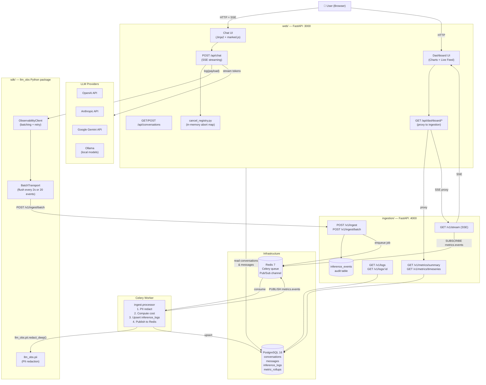
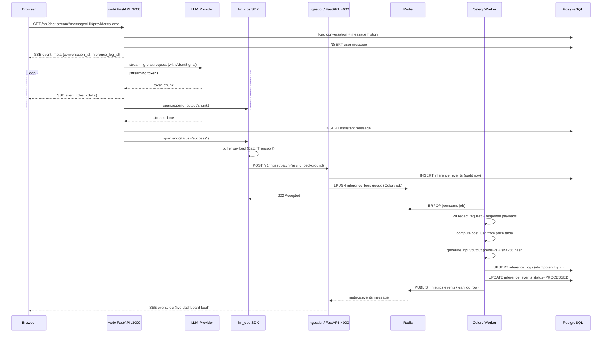
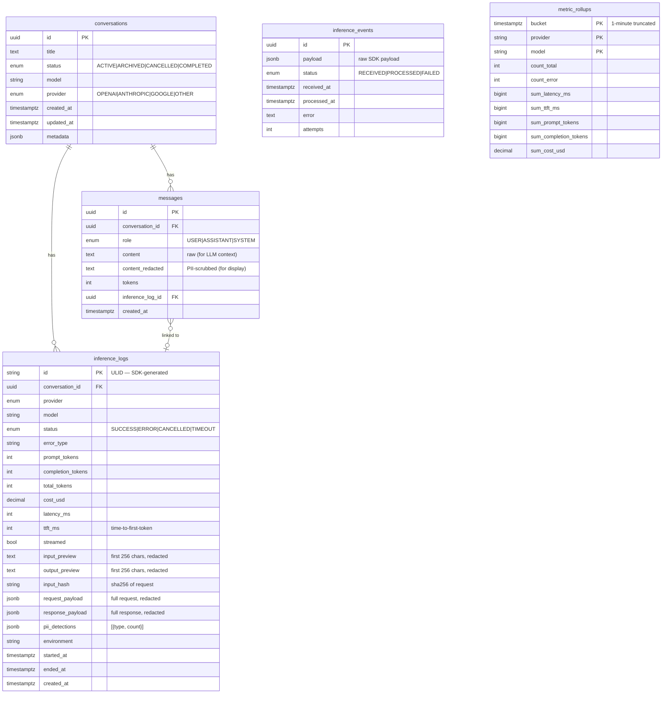
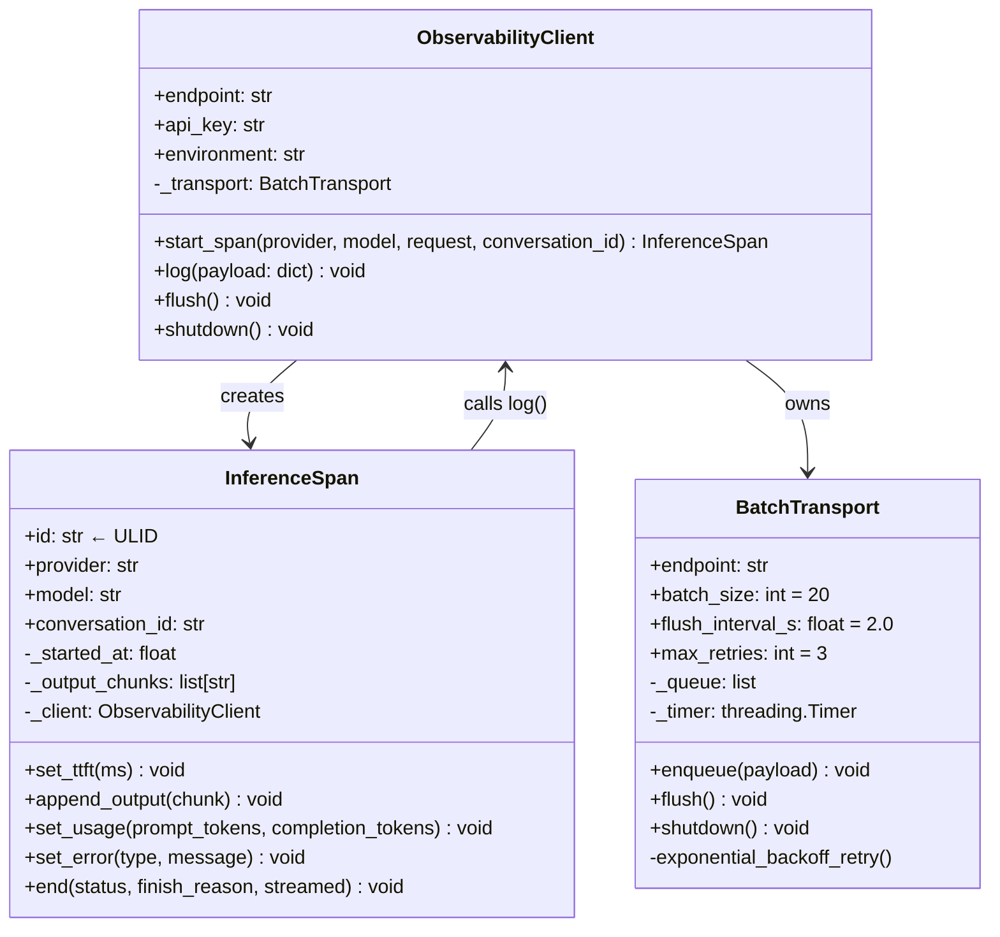
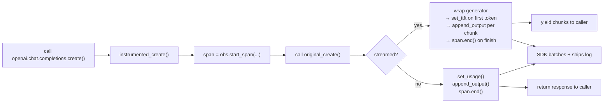
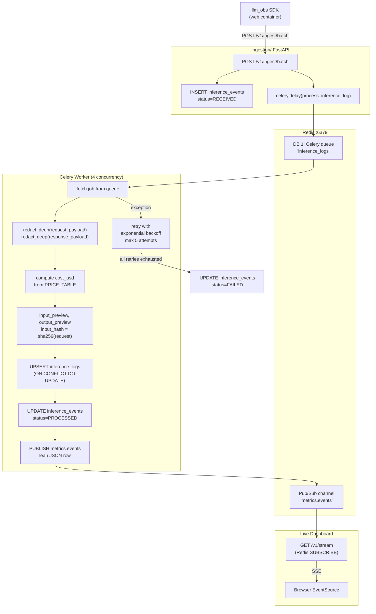
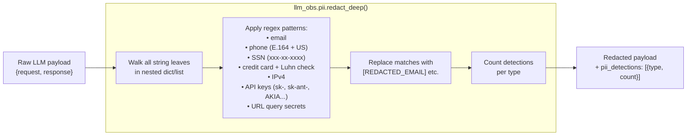
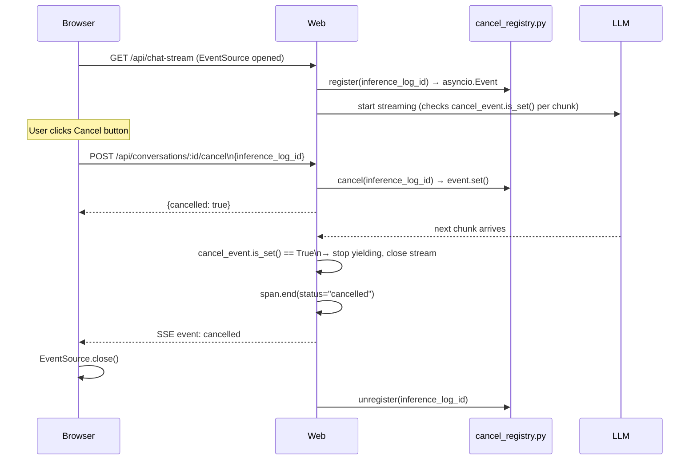
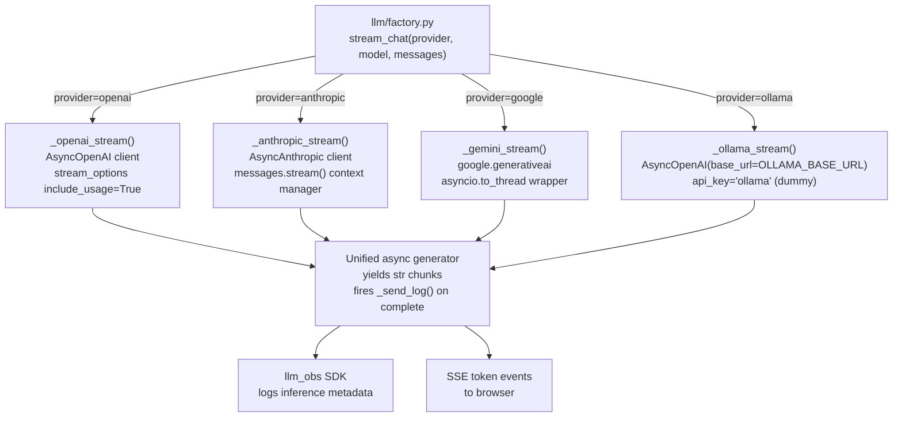
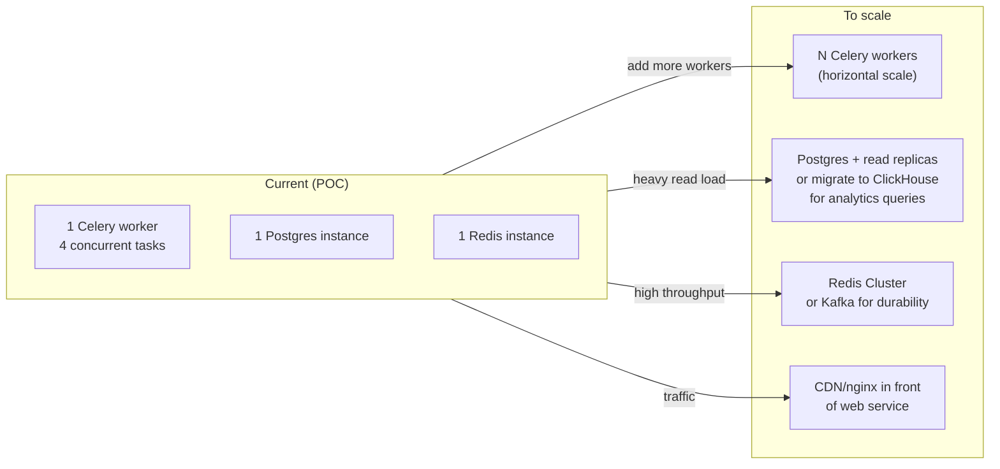

# LLM Observability & Inference Logging — Architecture

> **Python-based** lightweight inference logging and ingestion system for LLM applications.
> Multi-provider support · Streaming responses · Event-driven processing · PII redaction · Live dashboards

---

## 1. System Overview



---

## 2. Tech Stack

| Layer | Technology | Why |
|---|---|---|
| Language | **Python 3.12** | Single language across all services |
| Web Framework | **FastAPI** (both services) | Async, fast, built-in OpenAPI docs |
| Templates | **Jinja2** + **Tailwind CSS** (CDN) | Lightweight UI, no JS build step |
| Markdown | **marked.js** (CDN) | Render LLM markdown responses in browser |
| ORM | **SQLAlchemy 2.0** (async) + **asyncpg** | Best async Postgres support in Python |
| Migrations | **Alembic** | Schema version control |
| Queue | **Celery** + **Redis** | Async job processing, retries, backoff |
| Pub/Sub | **Redis Pub/Sub** | Live dashboard feed |
| Streaming | **SSE (Server-Sent Events)** | Unidirectional, works over HTTP, no WS needed |
| LLM SDKs | `openai`, `anthropic`, `google-generativeai` | Official provider SDKs |
| Local LLMs | **Ollama** (OpenAI-compatible API) | Zero-cost local inference |
| PII | Custom regex + Luhn (no external services) | Deterministic, zero latency, no data leaving |
| Database | **PostgreSQL 16** | JSONB, percentile queries, reliable |
| Containers | **Docker Compose** | One-command setup |

---

## 3. Repository Structure

```
llm-observability/
├── sdk/                        # Python package: llm_obs
│   ├── pyproject.toml
│   └── llm_obs/
│       ├── client.py           # ObservabilityClient
│       ├── span.py             # InferenceSpan (per-call lifecycle)
│       ├── transport.py        # BatchTransport (buffer → flush → POST)
│       ├── id.py               # ULID generation
│       ├── providers/
│       │   ├── openai.py       # wrap_openai()
│       │   ├── anthropic.py    # wrap_anthropic()
│       │   └── gemini.py       # wrap_gemini()
│       └── pii/
│           ├── patterns.py     # Regex catalog (email, phone, SSN, CC, IP, API keys)
│           ├── luhn.py         # Credit card Luhn validation
│           └── redact.py       # redact() + redact_deep()
│
├── ingestion/                  # FastAPI :4000 + Celery worker
│   ├── requirements.txt
│   ├── Dockerfile
│   ├── entrypoint.sh           # Runs Alembic migrations then starts server
│   ├── alembic/
│   │   └── env.py
│   └── app/
│       ├── main.py             # FastAPI app, routers registered
│       ├── config.py           # Pydantic settings (env vars)
│       ├── database.py         # Async SQLAlchemy engine + session
│       ├── models.py           # ORM models
│       ├── schemas.py          # Pydantic request/response schemas
│       ├── worker.py           # Celery app definition
│       ├── tasks.py            # process_inference_log() task
│       ├── seed.py             # Synthetic data seeder
│       └── routers/
│           ├── health.py       # GET /v1/health
│           ├── ingest.py       # POST /v1/ingest, /batch
│           ├── logs.py         # GET /v1/logs, /logs/:id
│           ├── metrics.py      # GET /v1/metrics/summary, /timeseries, /errors
│           └── stream.py       # GET /v1/stream (SSE → Redis sub)
│
├── web/                        # FastAPI :3000 (chat + dashboard UI)
│   ├── requirements.txt
│   ├── Dockerfile
│   └── app/
│       ├── main.py             # FastAPI app + page routes
│       ├── config.py           # Settings
│       ├── database.py         # Async SQLAlchemy (reads conversations/messages)
│       ├── models.py           # Conversation + Message ORM models
│       ├── cancel_registry.py  # In-memory {inference_log_id → asyncio.Event}
│       ├── llm/
│       │   └── factory.py      # stream_chat() + get_provider_client() + Ollama discovery
│       ├── routers/
│       │   ├── chat.py         # POST /api/chat (SSE), GET /api/chat-stream
│       │   ├── conversations.py# CRUD /api/conversations
│       │   └── dashboard.py    # Proxy /api/dashboard/* → ingestion
│       └── templates/
│           ├── base.html       # Sidebar layout
│           ├── chat.html       # Chat UI (streaming, markdown, cancel)
│           ├── dashboard.html  # Metrics charts (Chart.js)
│           └── logs.html       # Log explorer + detail modal
│
├── docker-compose.yml          # All 6 services (prod)
├── docker-compose.dev.yml      # Infra only (postgres, redis, adminer)
├── .env.example
└── Makefile
```

---

## 4. Inference Logging Flow



---

## 5. Database Schema



### Key Schema Decisions

| Decision | Rationale |
|---|---|
| `inference_logs.id` is SDK-generated ULID | Allows idempotent upsert — Celery retries are safe |
| `messages.content` vs `content_redacted` | Raw content needed for LLM context window; redacted version used in dashboard |
| `inference_events` audit table | Stores raw payload before processing — enables replay if worker had a bug |
| `request_payload`/`response_payload` as JSONB | Schema-free, queryable, good for evolving LLM APIs |
| `metric_rollups` pre-aggregated | Dashboard time-series queries over 7d+ would be slow on `inference_logs` alone |
| ULID over UUID for log IDs | ULIDs are time-sortable and URL-safe |

---

## 6. SDK Design



### Provider Wrapping Strategy

Each provider wrapper (`wrap_openai`, `wrap_anthropic`, `wrap_gemini`, Ollama via `wrap_openai`) monkey-patches the client's create method:



---

## 7. Event-Driven Architecture



**Why event-driven?**
- The hot path (chat streaming) never waits for DB writes
- PII redaction and cost computation happen off the critical path
- `inference_events` table acts as a replay buffer — if the worker had a bug, reset `status=RECEIVED` and re-enqueue
- Celery retries handle transient failures transparently

---

## 8. PII Redaction Pipeline



**Design choices:**
- Regex-only (no external NLP service) — deterministic, zero latency, no data leaves the system
- Luhn algorithm validates credit card numbers before redacting — reduces false positives on long digit strings
- `redact_deep()` walks arbitrary nested JSON — handles both flat strings and deeply nested message arrays
- Worker is the canonical redactor; SDK-side redaction is opt-in (useful when ingestion is across a network boundary)

---

## 9. Cancel Conversation Flow



---

## 10. Multi-Provider Support



**Ollama specifics:** Ollama's `/v1` endpoint is OpenAI-API-compatible, so it reuses the exact same `AsyncOpenAI` client — only `base_url` differs. No API key required. Models are auto-discovered at runtime via `GET /api/tags`.

---

## 11. Scaling Considerations



| Concern | Current approach | At scale |
|---|---|---|
| Worker throughput | 1 Celery worker, 4 concurrent | Add more worker containers (stateless, easy) |
| DB analytics | Live aggregation on `inference_logs` | Pre-aggregate to `metric_rollups`; consider ClickHouse |
| Queue durability | Redis (in-memory) | Replace with Kafka or RabbitMQ for persistence |
| Idempotency | ULID primary key + `ON CONFLICT DO UPDATE` | Already safe at scale |
| PII | Per-message regex | Add NER (`spaCy`) for named entity detection |

---

## 12. Failure Handling

| Failure scenario | How it's handled |
|---|---|
| LLM provider timeout | `asyncio` timeout on streaming; `span.end(status="error")` logged |
| Ingestion API down | SDK `BatchTransport` retries with exponential backoff (250ms → 4s, 3 attempts) |
| Celery task crashes | Auto-retry up to 5× with exponential backoff; `inference_events.status=FAILED` after all retries |
| Worker had a bug (bad batch) | Reset `inference_events.status='RECEIVED'` → re-enqueue manually |
| Redis down | Celery queue unavailable; ingestion API returns 202 but job is lost — mitigated by `inference_events` audit row |
| Postgres down | Both services fail fast; `inference_events` acts as buffer when recovered |
| Duplicate ingest | `ON CONFLICT (id) DO UPDATE` in worker — safe to ingest same event multiple times |

---

## 13. API Reference

### Web Service (`:3000`)

| Method | Path | Description |
|---|---|---|
| `GET` | `/chat` | Chat UI page |
| `GET` | `/chat/:id` | Resume conversation |
| `GET` | `/dashboard` | Dashboard page |
| `GET` | `/logs` | Log explorer page |
| `GET` | `/api/chat-stream` | SSE: stream chat response |
| `GET` | `/api/conversations` | List conversations |
| `POST` | `/api/conversations` | Create conversation |
| `GET` | `/api/conversations/:id` | Get conversation + messages |
| `DELETE` | `/api/conversations/:id` | Archive conversation |
| `POST` | `/api/conversations/:id/cancel` | Cancel active inference |
| `GET` | `/api/dashboard/summary` | Aggregate metrics |
| `GET` | `/api/dashboard/timeseries` | Time-series metrics |
| `GET` | `/api/dashboard/logs` | Paginated log list |
| `GET` | `/api/dashboard/logs/:id` | Log detail |
| `GET` | `/api/dashboard/stream` | SSE live event feed |

### Ingestion Service (`:4000`)

| Method | Path | Auth | Description |
|---|---|---|---|
| `GET` | `/v1/health` | — | Health check (db + redis) |
| `POST` | `/v1/ingest` | `x-obs-api-key` | Ingest single log |
| `POST` | `/v1/ingest/batch` | `x-obs-api-key` | Ingest up to 100 logs |
| `GET` | `/v1/logs` | — | Paginated logs |
| `GET` | `/v1/logs/:id` | — | Log detail with full payload |
| `GET` | `/v1/metrics/summary` | — | Aggregate stats |
| `GET` | `/v1/metrics/timeseries` | — | Time-series data |
| `GET` | `/v1/metrics/errors` | — | Error breakdown |
| `GET` | `/v1/stream` | — | SSE live feed |

---

## 14. Ingestion Flow

Every LLM call goes through a two-stage pipeline: **capture → async process**.

```
LLM Call
   │
   ▼
llm_obs SDK  (runs inside web service)
   │  Wraps openai / anthropic / google-generativeai clients via monkey-patching
   │  Captures: model, provider, latency, TTFT, tokens, status, request/response
   │  Buffers payloads in memory (flush every 20 events or every 2s)
   │
   ▼  POST /v1/ingest/batch  (fire-and-forget, retries up to 3×)
   │
ingestion/ FastAPI  (:4000)
   │  1. Validate payload with Pydantic
   │  2. Write raw event to inference_events (audit row)
   │  3. Enqueue Celery job → Redis broker
   │  → returns 202 Accepted immediately (chat streaming is never blocked)
   │
   ▼  Celery job (async, off the hot path)
   │
Worker
   │  1. PII redact — request + response payloads via regex + Luhn
   │  2. Compute cost_usd from provider price table
   │  3. Derive input_preview, output_preview (256 chars), input_hash (sha256)
   │  4. UPSERT inference_logs (idempotent — ULID primary key)
   │  5. UPDATE inference_events → status = PROCESSED
   │  6. PUBLISH lean row to Redis channel "metrics.events"
   │
   ▼
Dashboard SSE consumers pick up the Redis pub/sub message → live feed updates
```

**Why two stages?** The chat streaming hot path never waits for DB writes. The worker handles heavy work (PII, cost, hashing) asynchronously. The `inference_events` table is a replay buffer — if the worker had a bug, reset `status='RECEIVED'` and re-enqueue.

---

## 15. Logging Strategy

### What gets captured per call

| Field | Description |
|---|---|
| `provider` / `model` | Who served the request |
| `latency_ms` | Total wall-clock time |
| `ttft_ms` | Time-to-first-token (streaming calls only) |
| `prompt_tokens` / `completion_tokens` | Token usage from provider |
| `cost_usd` | Computed from hardcoded price table |
| `status` | `SUCCESS`, `ERROR`, `CANCELLED`, `TIMEOUT` |
| `error_type` | e.g. `rate_limit`, `context_length` |
| `input_preview` / `output_preview` | First 256 chars, PII-redacted |
| `request_payload` / `response_payload` | Full JSONB, PII-redacted |
| `pii_detections` | `[{type: "email", count: 2}]` per log |

### Non-intrusive by design

The SDK monkey-patches the LLM client's `create` method once at startup. Application code calls the LLM exactly as before; the SDK intercepts transparently, measures, and ships the log via a background thread. Any SDK failure (network error, crash) is caught and swallowed — **it never breaks the LLM call itself**.

### PII before persistence

Redaction runs in the Celery worker **before** any data touches `inference_logs`. The `inference_events` table holds the raw payload temporarily and can be purged after processing. Detectors cover: email, phone, SSN, credit card (with Luhn), IPv4, API keys (OpenAI/Anthropic/AWS patterns), URL query secrets.

### Conversation context vs observability

Messages store both `content` (raw — used for multi-turn LLM context) and `content_redacted` (PII-scrubbed — used in dashboards). This keeps the chatbot accurate while keeping the observability layer privacy-safe.

---

## 16. Scaling Considerations

### What scales easily

- **`web/`** and **`ingestion/`** are stateless FastAPI apps — add replicas behind a load balancer with no changes
- **Celery workers** are stateless consumers — scale horizontally by adding containers; Redis distributes work automatically
- **SDK batching** absorbs bursts — events buffer in memory and flush every 2s or 20 events

### What becomes a bottleneck first

| Component | Bottleneck | Mitigation |
|---|---|---|
| PostgreSQL | Analytics queries on large `inference_logs` ranges | Pre-aggregate `metric_rollups` via Celery Beat; migrate to ClickHouse for analytics |
| Redis queue | In-memory only — no persistence on crash | Replace with Kafka for durable delivery |
| `inference_events` | Unbounded growth of raw payloads | Partition by `received_at`; purge rows after processing |
| PII regex | CPU-bound at very high volume | Dedicated PII service; cache by `input_hash` |

### Honest POC capacity bounds

- Single Postgres: ~1,000 inference logs/min comfortably
- Single Redis: ~10,000 pub/sub messages/sec
- Celery (4 concurrency, 1 worker): ~200 jobs/min

---

## 17. Failure Handling

### SDK → Ingestion

| Failure | Behaviour |
|---|---|
| Ingestion API down | `BatchTransport` retries 3× with exponential backoff (250ms → 2s → 4s). After all retries, event is **silently dropped** — logging must never break the application |
| SDK crash / process exit | In-memory buffer is lost for that window |

### Ingestion → Worker

| Failure | Behaviour |
|---|---|
| Worker crashes mid-job | `task_acks_late=True` — job is re-queued automatically before ACK |
| Worker throws an exception | Auto-retry up to 5× with backoff; `inference_events.status = FAILED` after all retries |
| Replay after a bad deploy | `UPDATE inference_events SET status='RECEIVED' WHERE status='FAILED'` then re-enqueue |

### Database

| Failure | Behaviour |
|---|---|
| Postgres down briefly | Services fail fast; Celery jobs stay in Redis and process when Postgres recovers |
| Duplicate ingest | `ON CONFLICT (id) DO UPDATE` — safe to ingest the same ULID multiple times |
| Partial worker run | Upsert is atomic per row; crash leaves event as `RECEIVED` and job retries clean |

### Assumptions

- **At-least-once delivery** is acceptable — a log may be processed twice (idempotent upsert handles it)
- **Best-effort SDK** — if the observability system is fully down, the product keeps working; that window of logs is lost, not queued indefinitely
- **Redis is available** — no fallback if Redis is down; queue and pub/sub both stop until it recovers

---

## 18. What Would Improve With More Time

1. **Alembic auto-migrations** — commit versioned migration files so schema changes are tracked and reproducible
2. **Authentication** — multi-tenant API key auth; user sessions per conversation
3. **Metric rollup Celery Beat job** — periodic task to materialise `metric_rollups` every minute instead of live aggregation
4. **Full-text search** — `pg_trgm` index on `input_preview`/`output_preview` for log search
5. **spaCy NER** — optional named-entity recognition for person/org PII (currently disabled due to FP rate)
6. **Kubernetes manifests** — `Deployment` + `Service` + `HorizontalPodAutoscaler` YAML for the 3 app services
7. **Playwright e2e test** — happy path: send message → verify it appears in dashboard live feed
8. **Cost table via DB** — make the price table configurable at runtime rather than hardcoded
9. **Loom/screenshot demo** — record walkthrough of chat + cancel + dashboard + log detail
