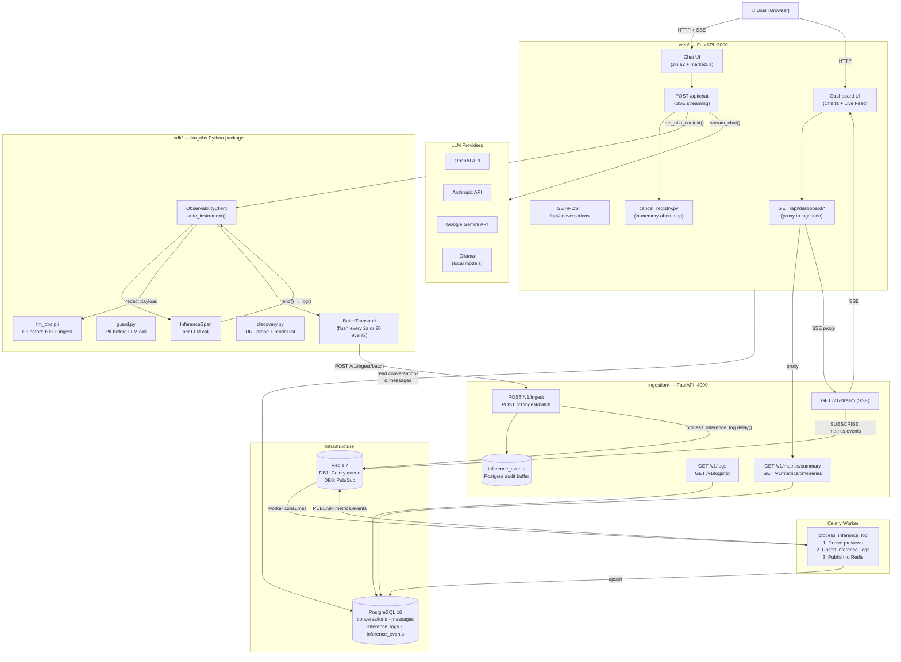
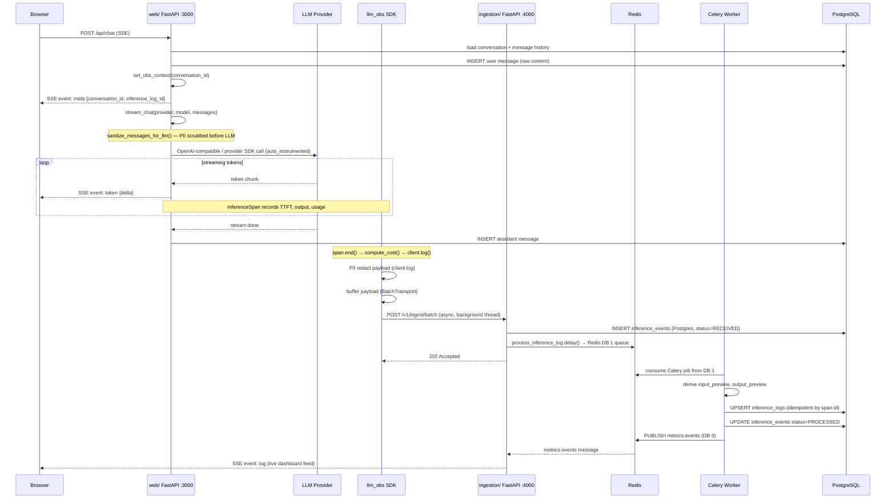
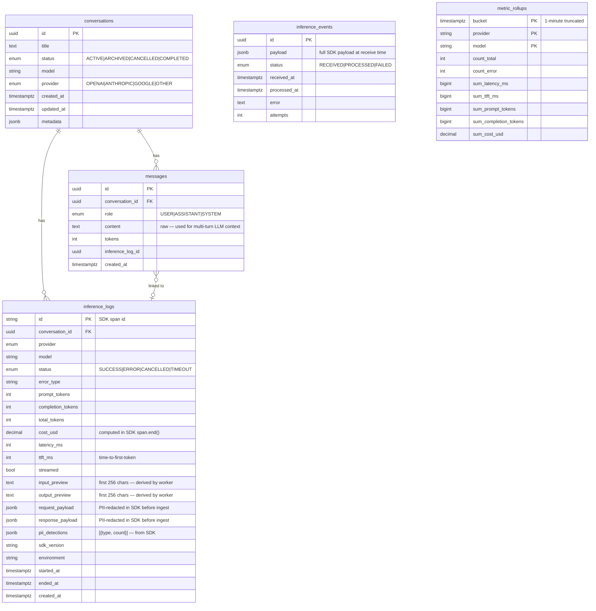
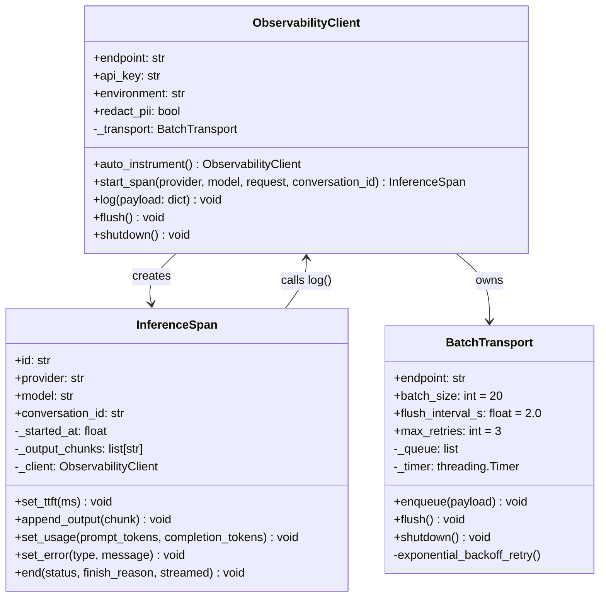
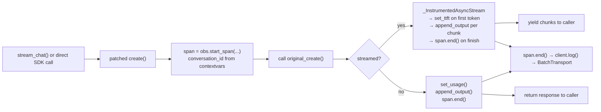
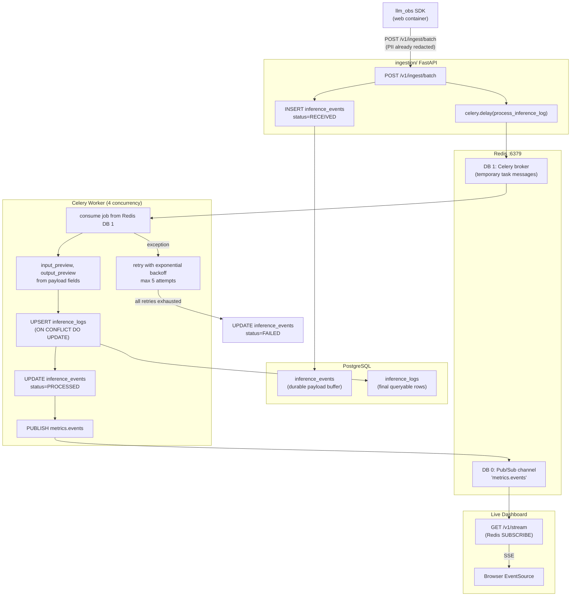
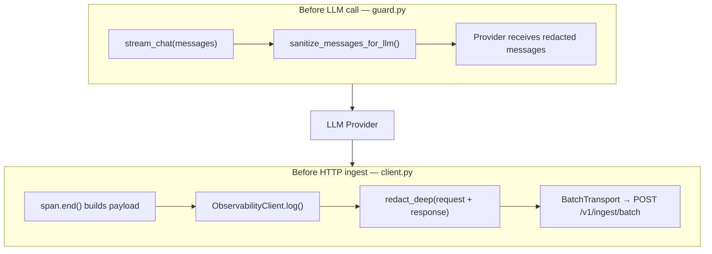
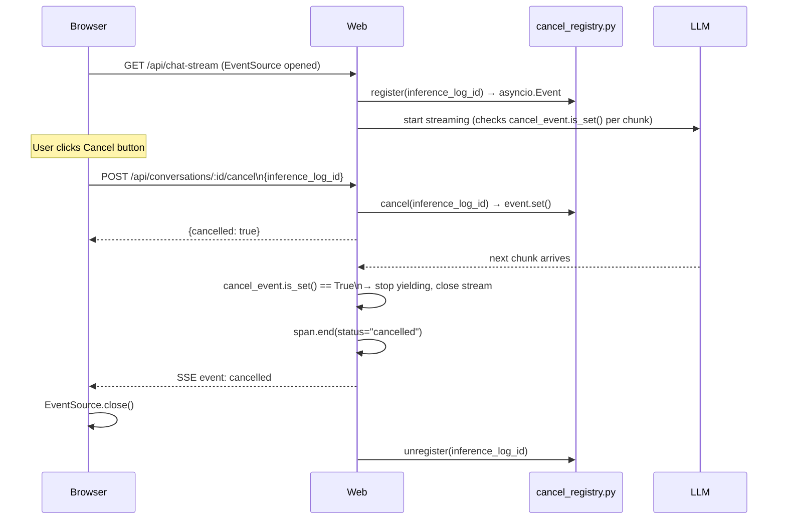
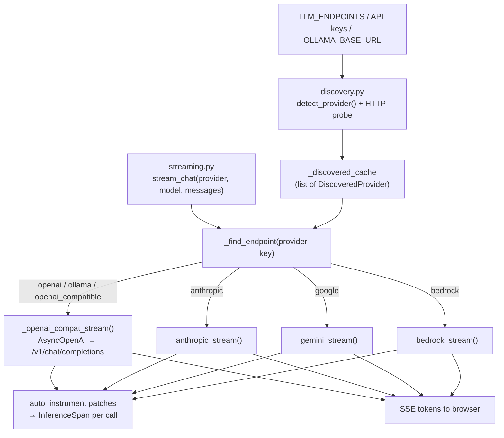
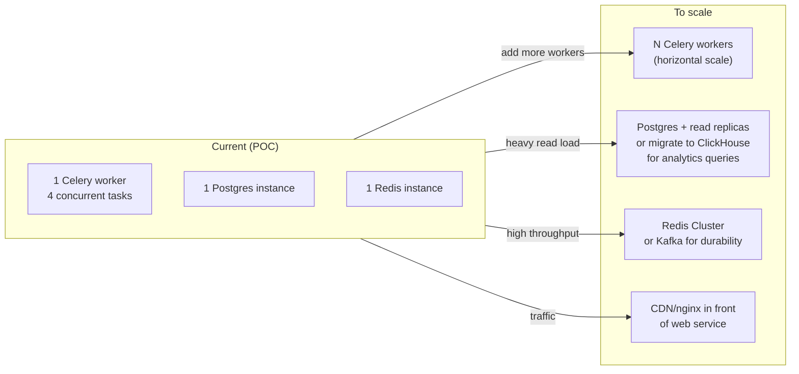

# LLM Observability & Inference Logging — Architecture

> **Python-based** lightweight inference logging and ingestion system for LLM applications.
> Multi-provider support · Streaming responses · Event-driven processing · PII redaction · Live dashboards

---

## 1. System Overview



---

## 2. Tech Stack

| Layer | Technology | Why |
|---|---|---|
| Language | **Python 3.12** | Single language across all services |
| Web Framework | **FastAPI** (both services) | Async, fast, built-in OpenAPI docs |
| Templates | **Jinja2** + **Tailwind CSS** (CDN) | Lightweight UI, no JS build step |
| Markdown | **marked.js** (CDN) | Render LLM markdown responses in browser |
| ORM | **SQLAlchemy 2.0** (async) + **asyncpg** | Best async Postgres support in Python |
| Migrations | **Alembic** | Schema version control |
| Queue | **Celery** + **Redis** | Async job processing, retries, backoff |
| Pub/Sub | **Redis Pub/Sub** | Live dashboard feed |
| Streaming | **SSE (Server-Sent Events)** | Unidirectional, works over HTTP, no WS needed |
| LLM SDKs | `openai`, `anthropic`, `google-generativeai` | Official provider SDKs |
| Local LLMs | **Ollama** (OpenAI-compatible API) | Zero-cost local inference |
| PII | Custom regex + Luhn (no external services) | Deterministic, zero latency, no data leaving |
| Database | **PostgreSQL 16** | JSONB, percentile queries, reliable |
| Containers | **Docker Compose** | One-command setup |

---

## 3. Repository Structure

```
llm-observability/
├── sdk/                        # Python package: llm_obs
│   ├── pyproject.toml
│   └── llm_obs/
│       ├── client.py           # ObservabilityClient + auto_instrument()
│       ├── span.py             # InferenceSpan (per-call lifecycle)
│       ├── context.py          # set_obs_context() — contextvars for conversation_id
│       ├── guard.py            # sanitize_messages_for_llm() — PII before LLM
│       ├── discovery.py        # URL probe, model detection, LLM_ENDPOINTS parsing
│       ├── streaming.py        # stream_chat() — unified multi-provider streaming
│       ├── transport.py        # BatchTransport (buffer → flush → POST)
│       ├── id.py               # unique id generation
│       ├── providers/
│       │   ├── interceptor.py  # install_provider_interceptors()
│       │   ├── openai.py       # patches AsyncCompletions.create
│       │   ├── anthropic.py    # patches AsyncMessages.create
│       │   ├── gemini.py       # patches generate_content_async
│       │   └── bedrock.py      # patches bedrock-runtime invoke
│       └── pii/
│           ├── patterns.py     # Regex catalog
│           ├── luhn.py         # Credit card Luhn validation
│           └── redact.py       # redact() + redact_deep()
│
├── ingestion/                  # FastAPI :4000 + Celery worker
│   ├── requirements.txt
│   ├── Dockerfile
│   ├── entrypoint.sh           # Runs Alembic migrations then starts server
│   ├── alembic/
│   │   ├── env.py
│   │   └── versions/           # e.g. drop messages.content_redacted
│   └── app/
│       ├── main.py             # FastAPI app, routers registered
│       ├── config.py           # Pydantic settings (env vars)
│       ├── database.py         # Async SQLAlchemy engine + session
│       ├── models.py           # ORM models
│       ├── schemas.py          # Pydantic request/response schemas
│       ├── worker.py           # Celery app definition
│       ├── tasks.py            # process_inference_log() task
│       ├── seed.py             # Synthetic data seeder
│       └── routers/
│           ├── health.py       # GET /v1/health
│           ├── ingest.py       # POST /v1/ingest, /batch
│           ├── logs.py         # GET /v1/logs, /logs/:id
│           ├── metrics.py      # GET /v1/metrics/summary, /timeseries, /errors
│           └── stream.py       # GET /v1/stream (SSE → Redis sub)
│
├── web/                        # FastAPI :3000 (chat + dashboard UI)
│   ├── requirements.txt
│   ├── Dockerfile
│   └── app/
│       ├── main.py             # FastAPI app + page routes
│       ├── config.py           # Settings
│       ├── database.py         # Async SQLAlchemy (reads conversations/messages)
│       ├── models.py           # Conversation + Message ORM models
│       ├── cancel_registry.py  # In-memory {inference_log_id → asyncio.Event}
│       ├── messages.py         # build_llm_messages(), new_user_message(), etc.
│       ├── routers/
│       │   ├── chat.py         # POST /api/chat (SSE) — uses llm_obs.stream_chat
│       │   ├── conversations.py# CRUD /api/conversations
│       │   └── dashboard.py    # Proxy /api/dashboard/* → ingestion
│       └── templates/
│           ├── base.html       # Sidebar layout
│           ├── chat.html       # Chat UI (streaming, markdown, cancel)
│           ├── dashboard.html  # Metrics charts (Chart.js)
│           └── logs.html       # Log explorer + detail modal
│
├── docker-compose.yml          # All 6 services (prod)
├── docker-compose.dev.yml      # Infra only (postgres, redis, adminer)
├── .env.example
└── Makefile
```

---

## 4. Inference Logging Flow



---

## 5. Database Schema



### Key Schema Decisions

| Decision | Rationale |
|---|---|
| `inference_logs.id` is SDK span id | Allows idempotent upsert — Celery retries are safe |
| `messages.content` only (no redacted column) | Raw history for LLM context; privacy lives in `inference_logs` + SDK redaction before LLM |
| `inference_events` in Postgres + Celery queue in Redis DB 1 | Postgres = durable payload buffer; Redis = temporary work queue |
| PII redaction in SDK, not worker | Scrub before data leaves the web process; worker is a simple writer |
| `cost_usd` computed in `span.end()` | Price table lives in SDK; worker stores pre-computed value |
| `request_payload`/`response_payload` as JSONB | Schema-free, queryable, handles evolving LLM APIs |
| `metric_rollups` pre-aggregated | Dashboard time-series over 7d+ would be slow on `inference_logs` alone |

---

## 6. SDK Design



### Provider instrumentation strategy

`auto_instrument()` patches provider SDK methods at class level via `providers/interceptor.py`:



---

## 7. Event-Driven Architecture



**Why event-driven?**
- The hot path (chat streaming) never waits for DB writes
- Worker is a lightweight writer — PII and cost already done in SDK
- `inference_events` (Postgres) + Redis Celery queue = durable buffer + async dispatch
- Celery retries handle transient failures transparently

---

## 8. PII Redaction Pipeline

PII is redacted in **two SDK choke points** — never in the Celery worker.



**Detectors** (in `llm_obs.pii`): email, phone, SSN, credit card (Luhn), IPv4, API keys, URL query secrets.

**Design choices:**
- Regex-only — deterministic, zero latency, no external NLP service
- Worker stores payloads as received (already redacted by SDK)
- `inference_events.payload` may contain pre-redacted data from SDK at receive time

---

## 9. Cancel Conversation Flow



---

## 10. Multi-Provider Support



### URL probing (`discovery.py`)

| Server type | Probe | Models from |
|---|---|---|
| Ollama | `GET {url}/api/tags` | `models[].name` |
| OpenAI-compatible (vLLM, LiteLLM, etc.) | `GET {url}/v1/models` | `data[].id` |
| Bedrock | `bedrock.list_foundation_models()` | `modelId` |
| OpenAI / Anthropic / Google | Known URL patterns | Static default list |
| Unknown / probe fails | Fallback | `LLM_DEFAULT_MODEL` or `"default"` |

**Ollama call path:** detected via `/api/tags`, called via OpenAI-compatible `/v1/chat/completions` (same as vLLM).

---

## 11. Scaling Considerations



| Concern | Current approach | At scale |
|---|---|---|
| Worker throughput | 1 Celery worker, 4 concurrent | Add more worker containers (stateless, easy) |
| DB analytics | Live aggregation on `inference_logs` | Pre-aggregate to `metric_rollups`; consider ClickHouse |
| Queue durability | Redis (in-memory) | Replace with Kafka or RabbitMQ for persistence |
| Idempotency | SDK span id + `ON CONFLICT DO UPDATE` | Already safe at scale |
| PII | Per-message regex | Add NER (`spaCy`) for named entity detection |

---

## 12. Failure Handling

| Failure scenario | How it's handled |
|---|---|
| LLM provider timeout | `asyncio` timeout on streaming; `span.end(status="error")` logged |
| Ingestion API down | SDK `BatchTransport` retries with exponential backoff (250ms → 4s, 3 attempts) |
| Celery task crashes | Auto-retry up to 5× with exponential backoff; `inference_events.status=FAILED` after all retries |
| Worker had a bug (bad batch) | Reset `inference_events.status='RECEIVED'` → re-enqueue manually |
| Redis queue | In-memory Celery broker (DB 1) — job lost if Redis flushed before worker runs | Mitigated by `inference_events` in Postgres; replace with Kafka for durability |
| Postgres down | Both services fail fast; `inference_events` acts as buffer when recovered |
| Duplicate ingest | `ON CONFLICT (id) DO UPDATE` in worker — safe to ingest same event multiple times |

---

## 13. API Reference

### Web Service (`:3000`)

| Method | Path | Description |
|---|---|---|
| `GET` | `/chat` | Chat UI page |
| `GET` | `/chat/:id` | Resume conversation |
| `GET` | `/dashboard` | Dashboard page |
| `GET` | `/logs` | Log explorer page |
| `GET` | `/api/chat-stream` | SSE: stream chat response |
| `GET` | `/api/conversations` | List conversations |
| `POST` | `/api/conversations` | Create conversation |
| `GET` | `/api/conversations/:id` | Get conversation + messages |
| `DELETE` | `/api/conversations/:id` | Archive conversation |
| `POST` | `/api/conversations/:id/cancel` | Cancel active inference |
| `GET` | `/api/dashboard/summary` | Aggregate metrics |
| `GET` | `/api/dashboard/timeseries` | Time-series metrics |
| `GET` | `/api/dashboard/logs` | Paginated log list |
| `GET` | `/api/dashboard/logs/:id` | Log detail |
| `GET` | `/api/dashboard/stream` | SSE live event feed |

### Ingestion Service (`:4000`)

| Method | Path | Auth | Description |
|---|---|---|---|
| `GET` | `/v1/health` | — | Health check (db + redis) |
| `POST` | `/v1/ingest` | `x-obs-api-key` | Ingest single log |
| `POST` | `/v1/ingest/batch` | `x-obs-api-key` | Ingest up to 100 logs |
| `GET` | `/v1/logs` | — | Paginated logs |
| `GET` | `/v1/logs/:id` | — | Log detail with full payload |
| `GET` | `/v1/metrics/summary` | — | Aggregate stats |
| `GET` | `/v1/metrics/timeseries` | — | Time-series data |
| `GET` | `/v1/metrics/errors` | — | Error breakdown |
| `GET` | `/v1/stream` | — | SSE live feed |

---

## 14. Ingestion Flow

Every LLM call goes through: **SDK capture → HTTP ingest → Celery worker → Postgres**.

```
LLM Call (auto_instrumented)
   │
   ▼
InferenceSpan
   │  Records: latency, TTFT, tokens, output chunks, errors
   │  span.end() → compute_cost() → builds JSON payload
   │
   ▼
ObservabilityClient.log()
   │  PII redact request + response (redact_deep)
   │  Add environment, sdk_version, pii_detections
   │
   ▼
BatchTransport (in-memory buffer in web process)
   │  Flush every 20 events OR every 2s (background thread)
   │
   ▼  POST /v1/ingest/batch  (retries up to 3×, fire-and-forget)
   │
ingestion/ FastAPI  (:4000)
   │  1. Validate payload with Pydantic
   │  2. INSERT inference_events (Postgres, status=RECEIVED)
   │  3. process_inference_log.delay() → Redis DB 1 (Celery broker)
   │  → returns 202 Accepted (chat streaming never blocked)
   │
   ▼  Celery worker consumes from Redis DB 1
   │
Worker
   │  1. Derive input_preview, output_preview (256 chars)
   │  2. UPSERT inference_logs (idempotent — span id primary key)
   │  3. UPDATE inference_events → status = PROCESSED
   │  4. PUBLISH lean row to Redis DB 0 channel "metrics.events"
   │
   ▼
Dashboard SSE consumers → live feed updates
GET /v1/logs → reads inference_logs from Postgres
```

**Temporary storage:**
- **Redis DB 1** — Celery task messages (until worker consumes)
- **inference_events (Postgres)** — durable payload copy until processed

**Why two stages?** Chat never waits for DB writes. Worker is a simple async writer. Postgres audit table enables replay if processing fails.

---

## 15. Logging Strategy

### What gets captured per call

| Field | Description |
|---|---|
| `provider` / `model` | Who served the request |
| `latency_ms` | Total wall-clock time |
| `ttft_ms` | Time-to-first-token (streaming calls only) |
| `prompt_tokens` / `completion_tokens` | Token usage from provider |
| `cost_usd` | Computed in SDK `span.end()` via `metrics/cost.py` |
| `status` | `SUCCESS`, `ERROR`, `CANCELLED`, `TIMEOUT` |
| `error_type` | e.g. `rate_limit`, `context_length` |
| `input_preview` / `output_preview` | First 256 chars — derived by worker from payload |
| `request_payload` / `response_payload` | Full JSONB — PII-redacted in SDK before ingest |
| `pii_detections` | `[{type: "email", count: 2}]` — attached by SDK in `client.log()` |
| `conversation_id` | From `set_obs_context()` via contextvars |

### Non-intrusive by design

`ObservabilityClient.auto_instrument()` patches provider SDK `create` methods once at startup. Application code calls `stream_chat()` or provider SDKs as normal; `InferenceSpan` intercepts transparently. SDK transport failures are retried then dropped — **logging never breaks the LLM call**.

### Privacy model

| Layer | What's stored | PII handling |
|---|---|---|
| `messages.content` | Raw chat text | SDK redacts before LLM call; not duplicated in DB |
| `inference_logs` | Observability records | SDK redacts before HTTP ingest |
| Dashboard / logs UI | Reads `inference_logs` | Shows redacted previews and payloads |

---

## 16. Scaling Considerations

### What scales easily

- **`web/`** and **`ingestion/`** are stateless FastAPI apps — add replicas behind a load balancer with no changes
- **Celery workers** are stateless consumers — scale horizontally by adding containers; Redis distributes work automatically
- **SDK batching** absorbs bursts — events buffer in memory and flush every 2s or 20 events

### What becomes a bottleneck first

| Component | Bottleneck | Mitigation |
|---|---|---|
| PostgreSQL | Analytics queries on large `inference_logs` ranges | Pre-aggregate `metric_rollups` via Celery Beat; migrate to ClickHouse for analytics |
| Redis queue | In-memory only — no persistence on crash | Replace with Kafka for durable delivery |
| `inference_events` | Unbounded growth of raw payloads | Partition by `received_at`; purge rows after processing |
| PII regex | CPU-bound at very high volume | Dedicated PII service; cache by `input_hash` |

### Honest POC capacity bounds

- Single Postgres: ~1,000 inference logs/min comfortably
- Single Redis: ~10,000 pub/sub messages/sec
- Celery (4 concurrency, 1 worker): ~200 jobs/min

---

## 17. Failure Handling

### SDK → Ingestion

| Failure | Behaviour |
|---|---|
| Ingestion API down | `BatchTransport` retries 3× with exponential backoff (250ms → 2s → 4s). After all retries, event is **silently dropped** — logging must never break the application |
| SDK crash / process exit | In-memory buffer is lost for that window |

### Ingestion → Worker

| Failure | Behaviour |
|---|---|
| Worker crashes mid-job | `task_acks_late=True` — job is re-queued automatically before ACK |
| Worker throws an exception | Auto-retry up to 5× with backoff; `inference_events.status = FAILED` after all retries |
| Replay after a bad deploy | `UPDATE inference_events SET status='RECEIVED' WHERE status='FAILED'` then re-enqueue |

### Database

| Failure | Behaviour |
|---|---|
| Postgres down briefly | Services fail fast; Celery jobs stay in Redis and process when Postgres recovers |
| Duplicate ingest | `ON CONFLICT (id) DO UPDATE` — safe to ingest the same span id multiple times |
| Partial worker run | Upsert is atomic per row; crash leaves event as `RECEIVED` and job retries clean |

### Assumptions

- **At-least-once delivery** is acceptable — a log may be processed twice (idempotent upsert handles it)
- **Best-effort SDK** — if the observability system is fully down, the product keeps working; that window of logs is lost, not queued indefinitely
- **Redis is available** — no fallback if Redis is down; queue and pub/sub both stop until it recovers

---

## 18. What Would Improve With More Time

1. **Alembic migrations** — versioned schema changes (e.g. drop unused columns); expand migration history beyond initial revision
2. **Authentication** — multi-tenant API key auth; user sessions per conversation
3. **Metric rollup Celery Beat job** — periodic task to materialise `metric_rollups` every minute instead of live aggregation
4. **Full-text search** — `pg_trgm` index on `input_preview`/`output_preview` for log search
5. **spaCy NER** — optional named-entity recognition for person/org PII (currently disabled due to FP rate)
6. **Kubernetes manifests** — `Deployment` + `Service` + `HorizontalPodAutoscaler` YAML for the 3 app services
7. **Playwright e2e test** — happy path: send message → verify it appears in dashboard live feed
8. **Cost table via DB** — make the price table configurable at runtime rather than hardcoded
9. **Loom/screenshot demo** — record walkthrough of chat + cancel + dashboard + log detail
